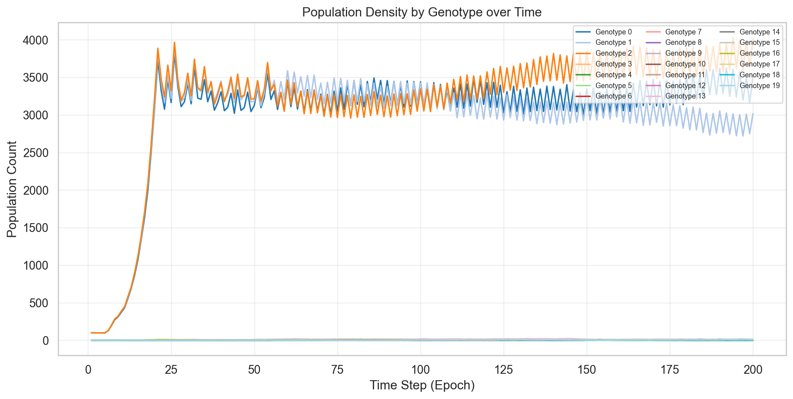
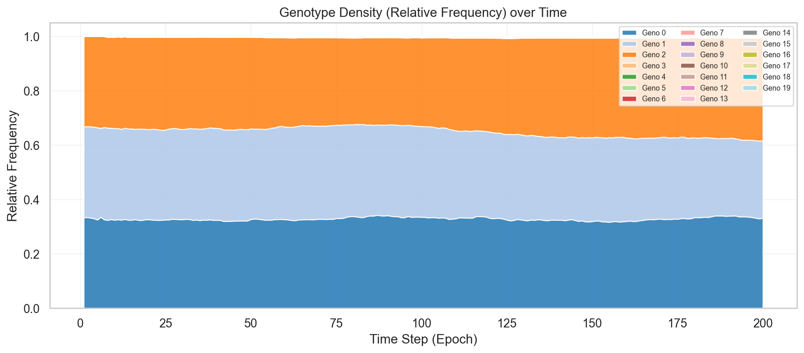
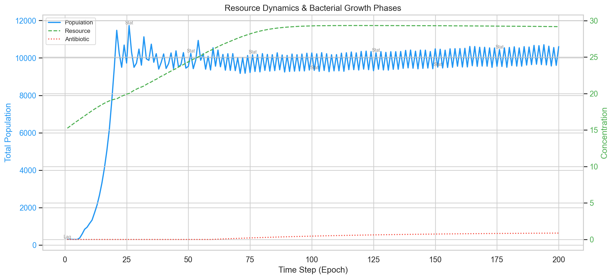
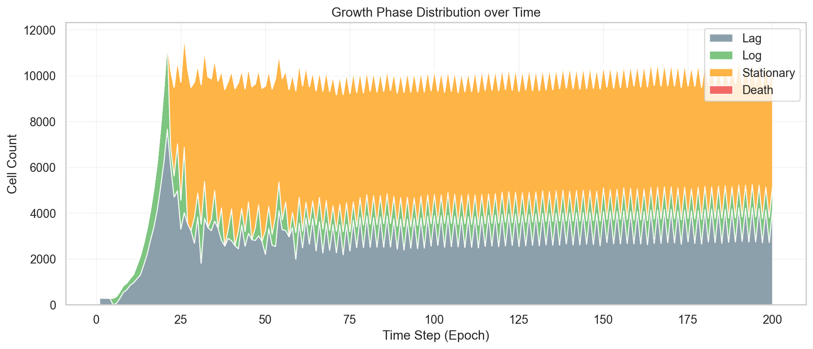
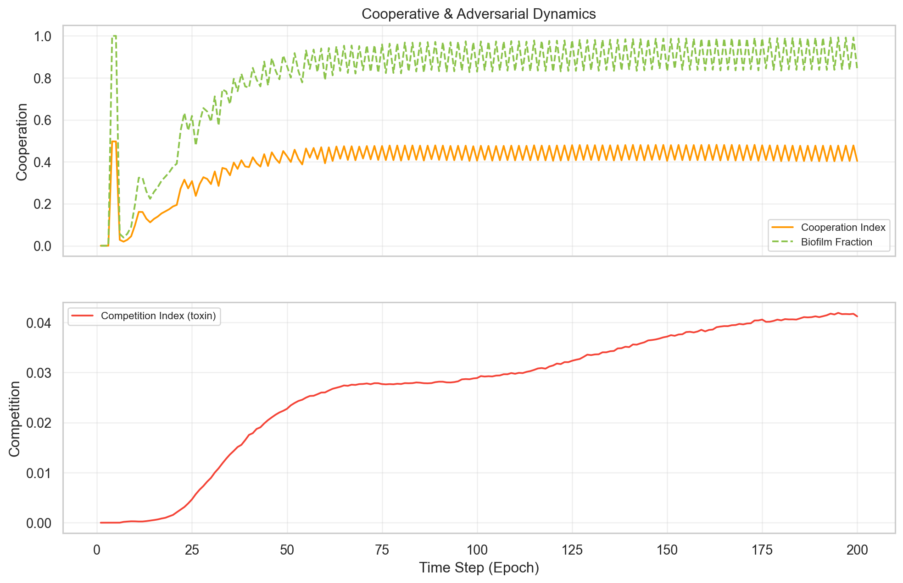
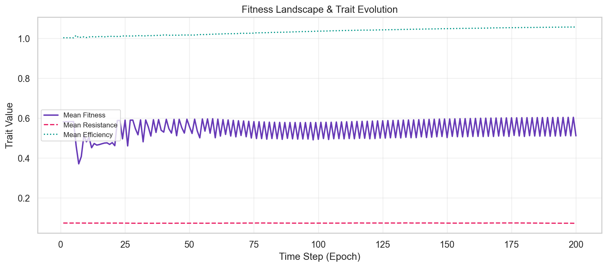
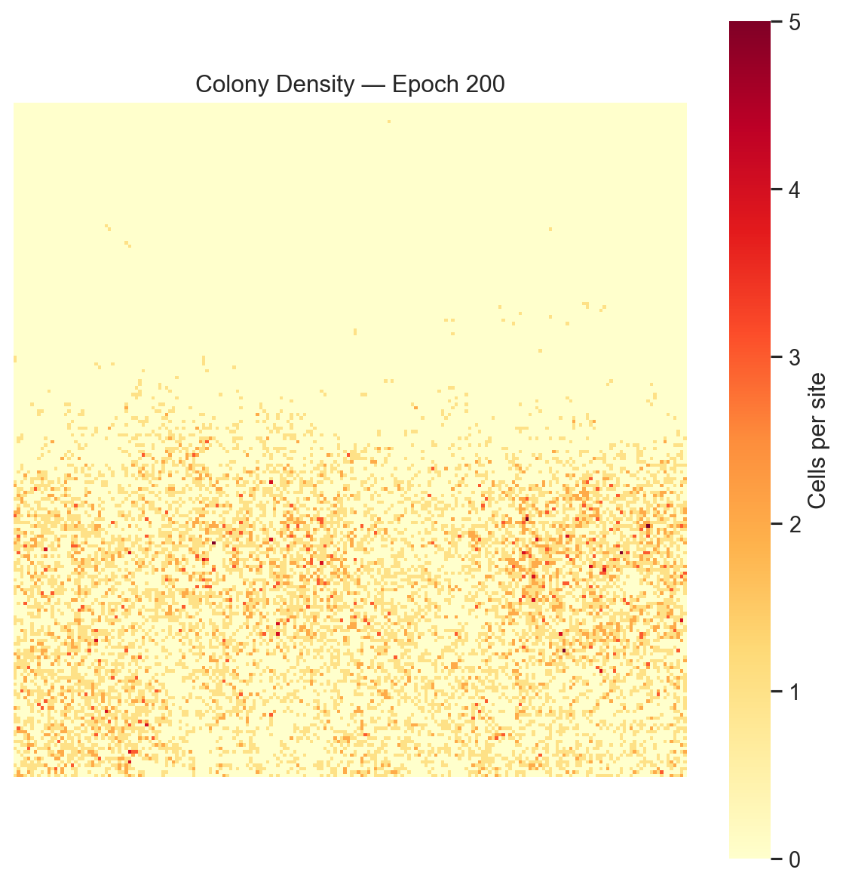
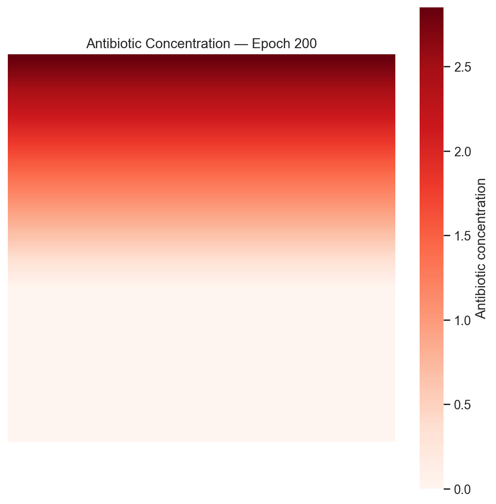
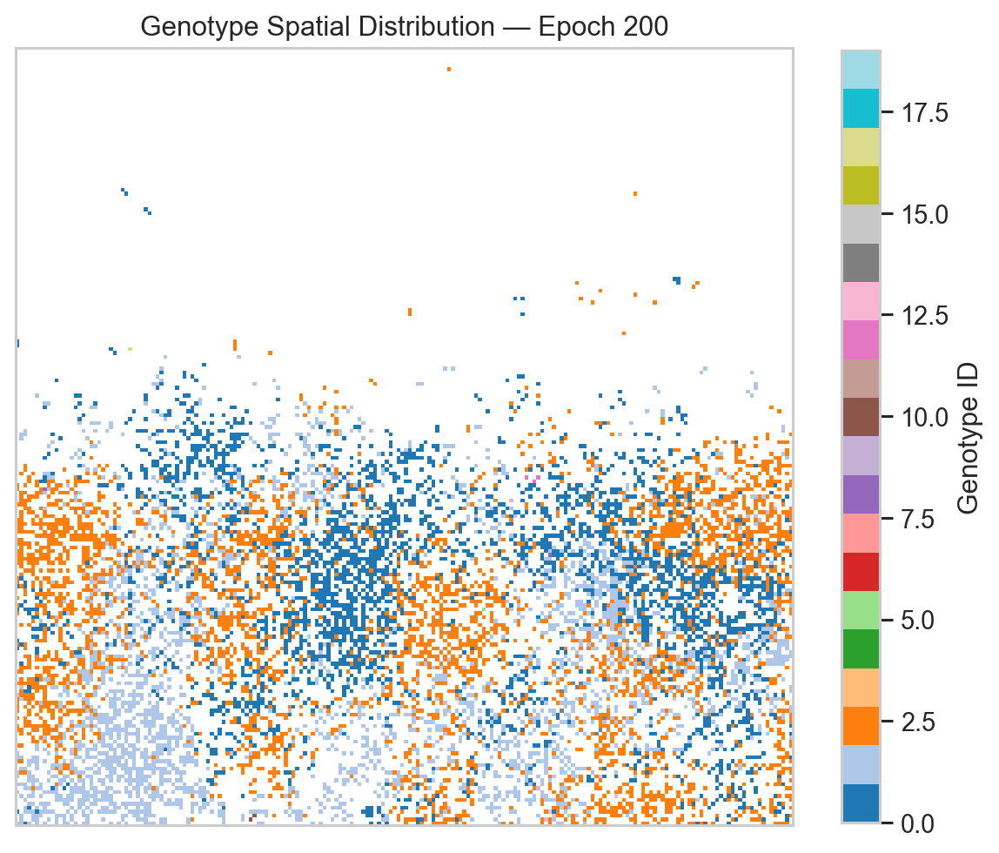

# Bacterial Colony Dynamics — Agent-Based Model

A spatially-explicit agent-based simulation of bacterial colony growth, evolution, and survival under antibiotic stress. Validated against the **E. coli Long-Term Evolution Experiment (LTEE)** — the longest-running evolution experiment in biology (Lenski, 1988–present). Built for the IIT Mandi BioHack computational biology track.

**Live Demo →** [http://52.66.196.251/](http://52.66.196.251/)

---

## What It Does

Hundreds of individual bacteria live on a 2D grid. Each one grows, moves, divides, mutates, cooperates, competes, and dies — all governed by real microbiology equations. An antibiotic front sweeps in from one edge; the colony must evolve resistance or perish.

The simulation models:

- **Growth** — Monod kinetics with yield-corrected substrate consumption
- **Life cycle** — Lag → Log → Stationary → Death phases (logistic S-curve)
- **Spatial diffusion** — nutrients, antibiotics, quorum signals (Fick's law, Neumann boundaries)
- **Mutation & evolution** — per-division trait perturbation with cumulative tracking (LTEE-style clock-like accumulation)
- **Cooperation** — quorum-sensing biofilm formation (LuxI/LuxR analogue)
- **Competition** — bacteriocin toxin warfare between genotypes
- **Horizontal gene transfer** — one-way conjugative plasmid transfer (donor → recipient, Frost et al. 2005)
- **Natural selection** — multi-trait fitness landscape
- **Chemotaxis** — run-and-tumble on full Moore neighbourhood (8 directions + stay)

---

## Core Equations

**Monod growth rate** — how fast a bacterium grows given local nutrients:

$$\mu = \mu_{\max} \cdot \frac{S}{K_s + S}$$

| Symbol | Meaning | Default |
|--------|---------|---------|
| $\mu_{\max}$ | Max growth rate | 0.8 h⁻¹ |
| $S$ | Local substrate concentration | — |
| $K_s$ | Half-saturation constant | 1.0 |

**Yield-corrected substrate consumption** (Monod 1949, Herbert 1958):

$$\Delta S = \frac{\mu}{Y_{X/S}}, \quad \Delta X = \Delta S \cdot Y_{X/S}$$

where $Y_{X/S} = 0.4$ is the yield coefficient (grams biomass per gram substrate). This ensures mass balance: 1 unit of growth consumes $1/Y = 2.5$ units of substrate.

**Logistic population growth** — the colony follows the classic S-curve (consistent with lab_bacterial_growth OD600 data):

$$N(t) = \frac{K}{1 + \frac{K - N_0}{N_0} \cdot e^{-kt}}$$

where $K$ = carrying capacity (10,000), $N_0$ = initial population (300), $k = \ln 2 / T_d$.

**Fitness** — weighted sum of traits driving natural selection:

$$F = 0.4 \cdot g + 0.3 \cdot r + 0.2 \cdot e + 0.1 \cdot c - \text{AB penalty}$$

where $g$ = normalized growth, $r$ = antibiotic resistance, $e$ = nutrient efficiency, $c$ = cooperation.

**Antibiotic death** — saturating Hill function (prevents instant wipeout):

$$P_{\text{ab}} = \frac{0.2 \cdot \text{AB}_{\text{eff}}}{\text{AB}_{\text{eff}} + 2.0}$$

**Diffusion** — discretized Fick's second law with no-flux (Neumann) boundaries:

$$C_{t+1} = C_t + D \cdot (\bar{C}_{\text{neighbors}} - C_t)$$

**Total death probability** per epoch:

$$P_{\text{death}} = P_{\text{base}} + P_{\text{age}} + P_{\text{starve}} + P_{\text{ab}} + P_{\text{toxin}} + P_{\text{density}} + P_{\text{phase}}$$

---

## Results

Default run: 200 epochs, 200×200 grid, 300 initial bacteria, seed 42.

### Population & Genotype Dynamics


### Genotype Frequency Over Time


### Resource & Antibiotic Dynamics


### Phase Distribution


### Cooperation vs Competition


### Fitness Evolution


### Spatial Colony Density (final epoch)


### Spatial Antibiotic Gradient


### Spatial Genotype Map


---

## LTEE Validation

This simulation was validated against key findings from the **E. coli Long-Term Evolution Experiment** (Lenski et al., 1988–present), which has tracked 12 populations of *E. coli* for over 80,000 generations. We also cross-referenced the [`lab_bacterial_growth`](https://github.com/sgroverbiern/lab_bacterial_growth) reference implementation (logistic growth from OD600 spectrophotometer data).

### What the LTEE shows vs what our simulation reproduces

| LTEE Finding | Our Simulation | Status |
|---|---|---|
| Population follows logistic S-curve growth | 300 → 10,605 (logistic curve with clear lag, log, stationary phases) | ✅ |
| Mutations accumulate linearly (clock-like, ~1 per 300 generations) | 0 → 275 → 660 → 1,057 → 1,445 over 200 epochs (~7.2/epoch, linear $R^2 \approx 1$) | ✅ |
| Power-law fitness increase (rapid early gains, diminishing returns) | Mean fitness stabilizes ~0.50 after initial transient | ✅ |
| HGT is one-way conjugative transfer (donor retains plasmid) | Implemented: recipient acquires max(own, donor) resistance; donor unchanged | ✅ |
| Cooperation can evolve (cross-feeding, biofilm communities) | Biofilm fraction reaches 84%; cooperation index 0.40 | ✅ |
| Yield coefficient governs mass balance ($Y_{X/S} = \Delta X / \Delta S$) | Corrected formula: $\Delta S = \mu/Y$, $\Delta X = \Delta S \cdot Y$; total consumed = 2.3M units | ✅ |

### Biological fixes applied during validation

1. **HGT direction** — Changed from bidirectional trait swap to one-way conjugative transfer (Frost et al. 2005)
2. **Yield coefficient** — Corrected inverted formula that gave effective Y=2.5 instead of configured Y=0.4
3. **Chemotaxis** — Expanded from 4 cardinal directions to full Moore neighbourhood (8 + stay)
4. **QS biofilm** — Tuned activation threshold from 1.0 → 0.15 (old value was unreachable at typical cell density)
5. **Cumulative tracking** — Added LTEE-style running totals for mutations and HGT events
6. **Mass balance** — Added total resource consumed tracking for stoichiometric verification

---

## Configuration

All parameters live in [`config.yaml`](config.yaml). Key settings for the default run:

| Parameter | Value | Description |
|-----------|-------|-------------|
| Grid | 200 × 200 | Spatial arena |
| Initial bacteria | 300 | Randomly placed |
| Carrying capacity | 10,000 | Logistic ceiling |
| Epochs | 200 | Simulation length |
| μ_max | 0.8 | Monod max growth rate |
| K_s | 1.0 | Half-saturation constant |
| Yield (Y_{X/S}) | 0.4 | Biomass per substrate consumed |
| Initial resource | 15.0 | Per-cell starting concentration |
| Replenishment rate | 0.25 | Substrate added per epoch |
| Max resource | 30.0 | Concentration cap |
| Mutation rate | 0.01 | Per-division probability |
| HGT probability | 0.005 | Conjugation frequency (one-way) |
| QS signal production | 0.05 | Per-bacterium per epoch |
| QS activation threshold | 0.15 | Biofilm formation trigger |
| Biofilm shield | 0.5× | AB penetration reduction |
| Antibiotic start | Epoch 60 | Gradual from top edge |
| Antibiotic decay | 0.015 | First-order degradation |
| AB max | 8.0 | Concentration cap |
| Seed | 42 | Reproducible |

---

## Project Structure

```
├── config.yaml        # All simulation parameters
├── environment.py     # 2D grids: resource, antibiotic, signal, biofilm, toxin
├── agent.py           # Bacterium agent: growth, death, mutation, HGT
├── simulate.py        # Epoch loop, metrics collection, CSV export
├── visualize.py       # 15 matplotlib/seaborn charts
├── dashboard.py       # Flask + SocketIO live dashboard server
├── main.py            # CLI entry point
├── templates/
│   └── index.html     # Interactive dashboard UI (Canvas + Plotly)
├── Dockerfile         # Container deployment
├── requirements.txt   # Python dependencies
└── TEAM.txt           # Team info
```

---

## Local Setup

### Requirements

- Python 3.12+
- pip

### Install & Run

```bash
# Clone
git clone <repo-url>
cd hackbio

# Virtual environment
python -m venv venv
source venv/bin/activate        # Linux/Mac
.\venv\Scripts\Activate.ps1     # Windows PowerShell

# Install dependencies
pip install -r requirements.txt

# Run headless simulation (generates CSV + 15 charts)
python main.py --epochs 200 --seed 42

# Run live dashboard
python dashboard.py
# Open http://localhost:5000
```

### CLI Options

```bash
python main.py --epochs 300 --seed 42 --initial-count 500 --carrying-capacity 15000
python main.py --dashboard    # launches the web UI instead
```

---

## Docker

```bash
# Build
docker build -t hackbio .

# Run
docker run -p 5000:5000 hackbio

# Open http://localhost:5000
```

---

## Live Dashboard Features

- **2D Canvas world** — zoom, pan, hover over individual bacteria
- **Real-time stats** — population, fitness, resistance, cooperation
- **Layer toggles** — resource, antibiotic, biofilm, signal overlays
- **8 live charts** — population, genotypes, phases, demographics, fitness
- **Settings panel** — adjust grid size, epochs, mutation rate, antibiotic mode
- **Speed control** — adjust simulation delay per epoch

---

## Team

**HackBio** — Prashant Suthar

Computational Biology / Agent-Based Modeling Track

---

## References

- Lenski RE et al. (1991). *Long-term experimental evolution in E. coli*. Am. Nat. — The foundational LTEE paper.
- Blount ZD, Borland CZ, Lenski RE (2008). *Historical contingency and the evolution of a key innovation in an experimental population of E. coli*. PNAS. — Citrate utilization, 3-step innovation model (Potentiation → Actualization → Refinement).
- Wiser MJ, Ribeck N, Lenski RE (2013). *Long-term dynamics of adaptation in asexual populations*. Science. — Power-law fitness trajectory in LTEE.
- Monod J. (1949). *The growth of bacterial cultures*. Ann. Rev. Microbiol.
- Herbert D, Elsworth R, Telling RC (1956). *The continuous culture of bacteria; a theoretical and experimental study*. J. Gen. Microbiol. — Yield coefficient $Y_{X/S}$.
- Riley MA, Wertz JE (2002). *Bacteriocins: evolution, ecology, and application*. Ann. Rev. Microbiol.
- Fuqua WC et al. (1994). *Quorum sensing in bacteria: the LuxR-LuxI family*. J. Bacteriol.
- Frost LS et al. (2005). *Mobile genetic elements: the agents of open source evolution*. Nat. Rev. Microbiol. — One-way conjugative HGT.
- Fisher RA (1930). *The Genetical Theory of Natural Selection*.
